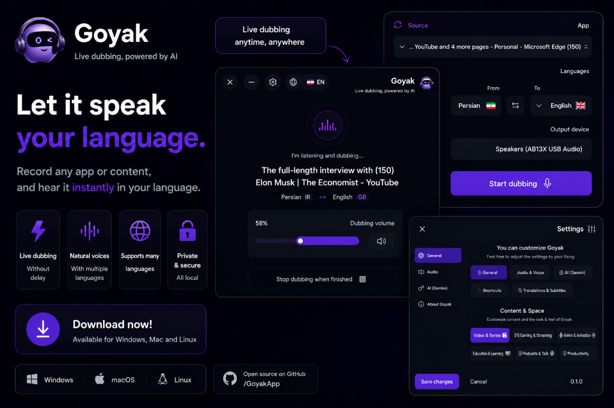

# Goyak — AI Real-Time Dubbing & Live Translation Desktop Application

  

Goyak is an open-source cross-platform desktop application that provides real-time AI audio dubbing and live translation for system and application audio.

## Downloads & Release Status

| Platform | Status | Download |
| :--- | :--- | :--- |
| **Windows** (x64) | 🟢 Available | [Download Latest Release](https://github.com/goyak-app/goyak-desktop/releases/latest) |
| **macOS** | 🟡 Under Development | Coming Soon |
| **Linux** | 🟡 Under Development | Coming Soon |

